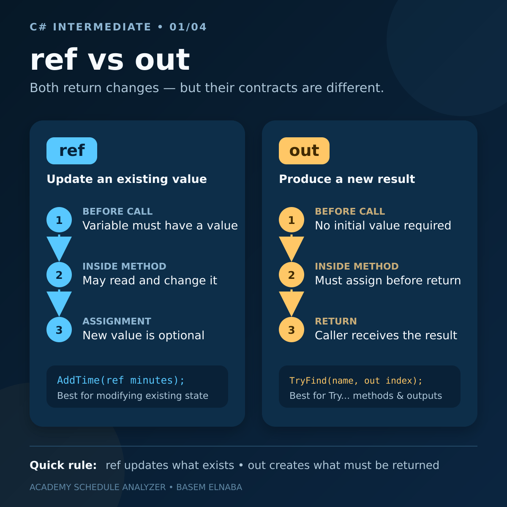
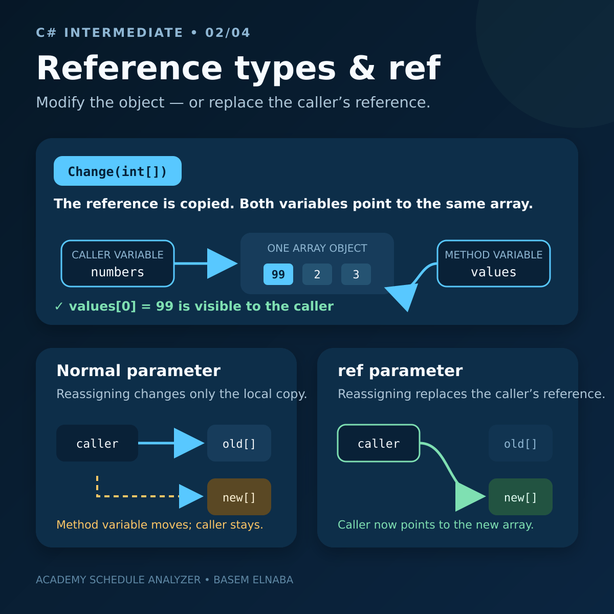
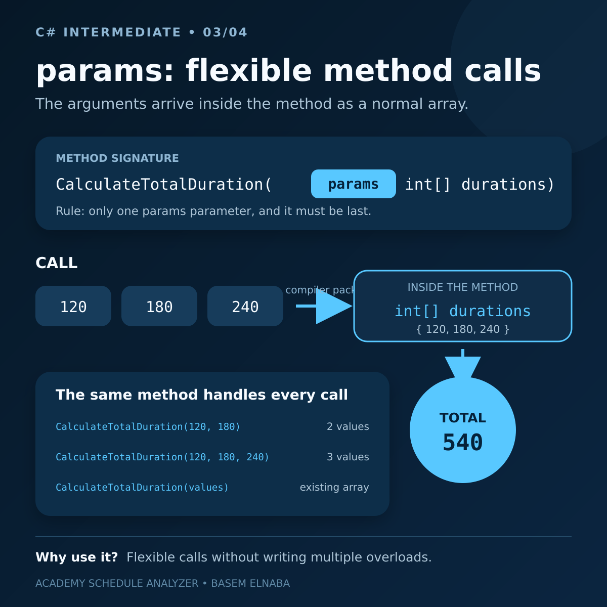
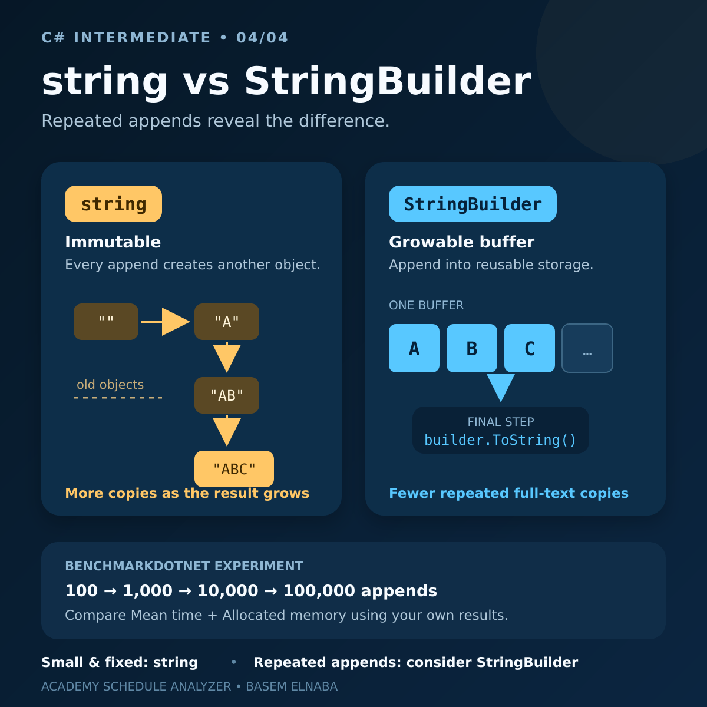

# LinkedIn Post Drafts

Review these drafts, run every example yourself, and adjust the wording so you can explain each idea confidently before publishing.

## Post 1 — `ref` vs `out` in C#



Suggested LinkedIn alt text: A side-by-side comparison showing that `ref` updates an initialized value while `out` requires the method to produce a value.

Today I learned that `ref` and `out` both allow a C# method to change a caller's variable, but they are used for different situations.

- A variable passed with `ref` must already have a value before the method call. The method can read it and change it, but it is not required to assign a new value.
- A variable passed with `out` does not need an initial value. However, the method must assign it before returning.

```csharp
static void AddExtraTime(ref int minutes)
{
    minutes += 30;
}

static bool TryGetDuration(string session, out int duration)
{
    if (session == "Arrays")
    {
        duration = 240;
        return true;
    }

    duration = 0;
    return false;
}

int minutes = 180;
AddExtraTime(ref minutes);

bool found = TryGetDuration("Arrays", out int duration);
```

In my Academy Schedule Analyzer, `ref` can update an existing duration, while `out` is useful when a search needs to return both a success result and another value such as the session duration.

My simple rule is: use `ref` when a value already exists and should be updated; use `out` when the method is responsible for producing the value.

#CSharp #DotNet #Programming #LearningInPublic

---

## Post 2 — `ref` with Reference Types



Suggested LinkedIn alt text: A C# reference diagram showing how a normal array parameter can mutate one shared object, while a `ref` parameter can replace the caller's array reference.

One C# detail that confused me at first was the difference between passing an array normally and passing it with `ref`.

An array is a reference type. When it is passed normally, the method receives a copy of the reference. It can still modify the same array object, so the caller sees changes to its elements.

```csharp
static void Change(int[] values)
{
    values[0] = 99;
}

int[] numbers = { 1, 2, 3 };
Change(numbers);
// numbers is now { 99, 2, 3 }
```

However, assigning a new array to that normal parameter changes only the method's local copy of the reference.

```csharp
static void ReplaceLocally(int[] values)
{
    values = new int[] { 10, 20, 30 };
}
```

To replace the caller's array variable itself, the parameter must use `ref`:

```csharp
static void Replace(ref int[] values)
{
    values = new int[] { 10, 20, 30 };
}

Replace(ref numbers);
// numbers now references the new array
```

The practical difference is:

- `Change(int[] values)` can modify the existing object.
- `Change(ref int[] values)` can also make the caller's variable reference a completely different object.

In a schedule application, I can update a session name inside the existing array without `ref`. I only need `ref` if the method must replace the whole schedule array.

#CSharp #ReferenceTypes #DotNet #SoftwareDevelopment

---

## Post 3 — The `params` Keyword in C#



Suggested LinkedIn alt text: A pipeline showing several integer arguments being packed into an `int[]` params parameter and totaled by one method.

The `params` keyword lets one C# method accept a variable number of arguments.

Instead of creating several overloads for two, three, or five session durations, I can write one method:

```csharp
static int CalculateTotalDuration(params int[] durations)
{
    int total = 0;

    foreach (int duration in durations)
    {
        total += duration;
    }

    return total;
}

Console.WriteLine(CalculateTotalDuration(120, 180));
Console.WriteLine(CalculateTotalDuration(120, 180, 240));
Console.WriteLine(CalculateTotalDuration(60, 90, 120, 180, 240));
```

Inside the method, `durations` is simply an `int[]`. The caller can pass separate values or an existing integer array.

This is useful in my Academy Schedule Analyzer because the same function can total any number of training sessions. It keeps the calling code short without losing type safety.

One important rule: a method can have only one `params` parameter, and it must be the last parameter.

#CSharp #DotNet #CodingTips #LearningInPublic

---

## Post 4 — `string` vs `StringBuilder` in C#



Suggested LinkedIn alt text: A comparison of immutable string concatenation creating new objects and StringBuilder appending into one growable buffer.

While building my Academy Schedule Analyzer, I compared normal string concatenation with `StringBuilder` using BenchmarkDotNet.

A C# `string` is immutable. This means that an existing string cannot be changed. Repeated code such as `result += text` creates another string containing the old and new content.

```csharp
string result = string.Empty;

for (int i = 0; i < iterations; i++)
{
    result += "Session";
}
```

`StringBuilder` works differently. It keeps a growable buffer and appends into that buffer instead of creating a complete new string on every iteration.

```csharp
StringBuilder result = new StringBuilder();

for (int i = 0; i < iterations; i++)
{
    result.Append("Session");
}

string finalText = result.ToString();
```

My BenchmarkDotNet test used equivalent work with 100, 1,000, 10,000, and 100,000 iterations, including memory diagnostics.

- At 100 iterations: `[add your measured observation and numbers]`
- At 100,000 iterations: `[add your measured observation and numbers]`
- Allocation result: `[add which method allocated more memory and the measured values]`

My main observation was: `[complete this sentence from your own benchmark output]`.

This does not mean `StringBuilder` is always the best option. Normal concatenation and interpolation are clear and appropriate for a small, fixed number of strings. `StringBuilder` becomes useful when text is appended repeatedly, especially inside a large loop.

#CSharp #StringBuilder #BenchmarkDotNet #Performance #DotNet
